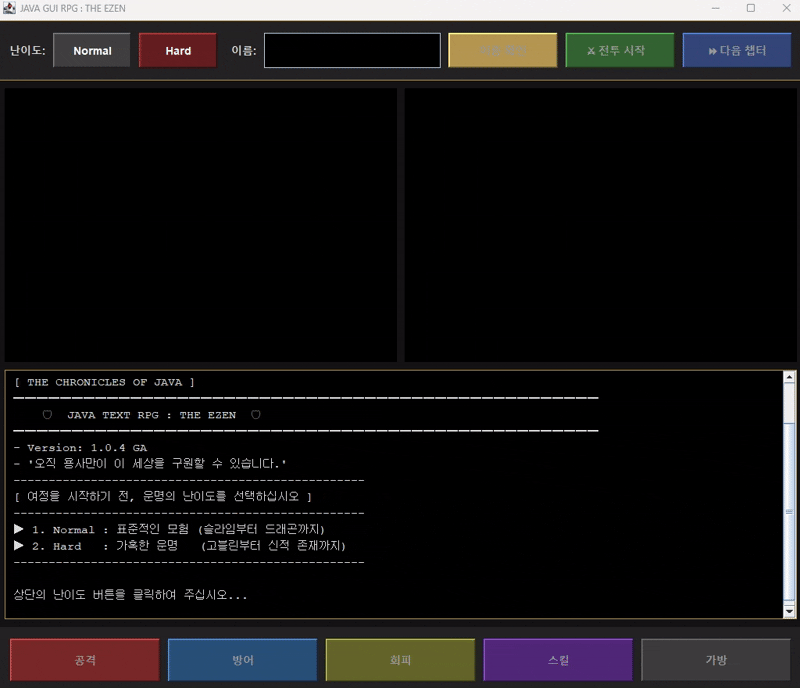
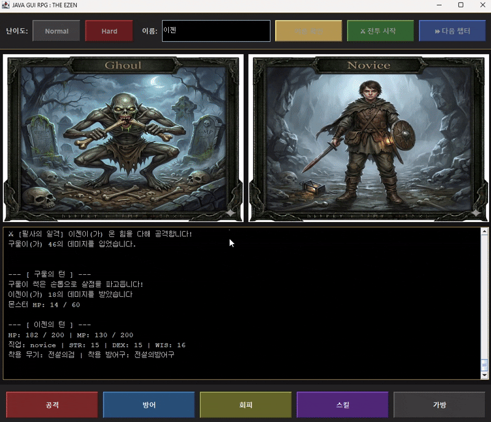
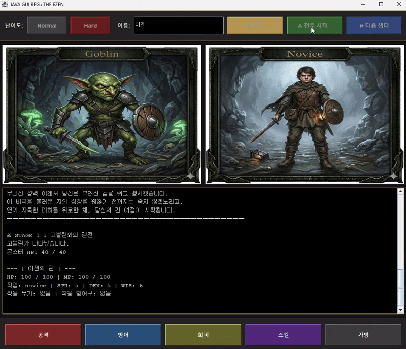
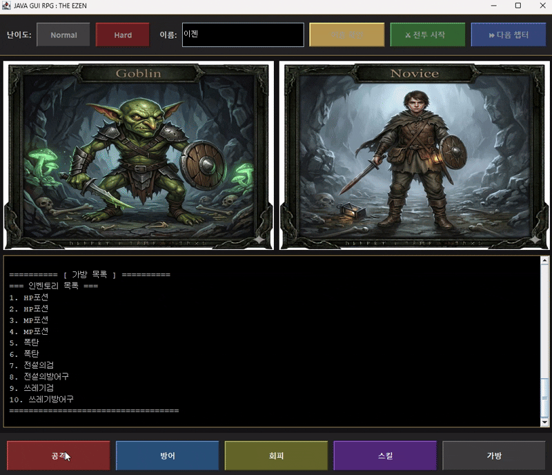
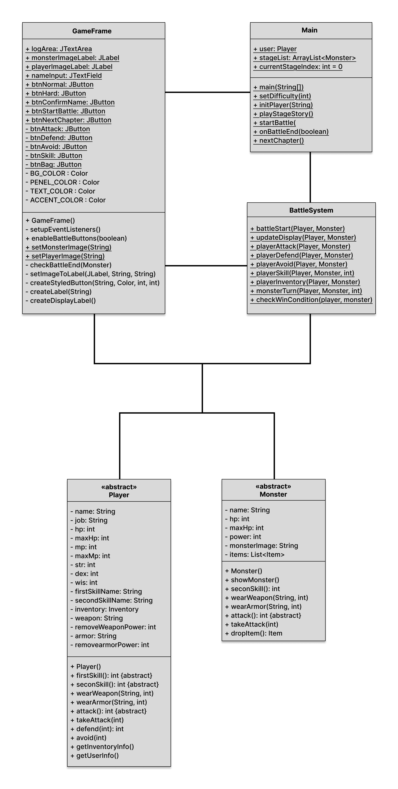
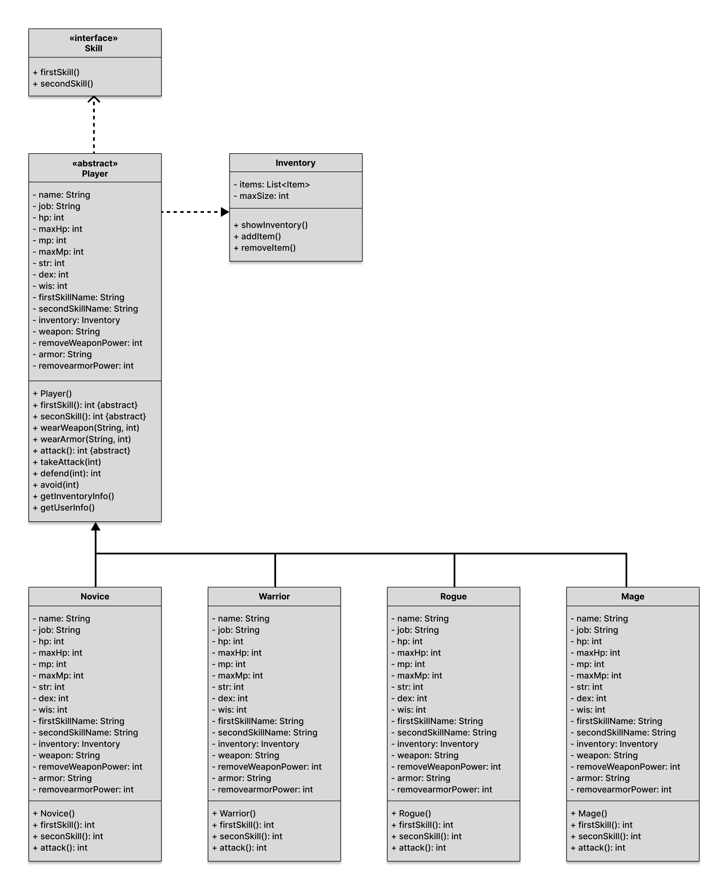

# 🛡️ THE CHRONICLES OF JAVA : THE EZEN 🛡️

> **"자바 객체지향의 정수를 담은 텍스트 RPG"**
> 타오르는 고향의 복수를 위해 폭룡 아카르를 찾아 떠나는 용사의 서사를 담은 GUI 기반 RPG 게임입니다.

---

## 1. 프로젝트 설계 의도

* **직업별 대사 및 메커니즘 차별화**
    * 동일한 행동(공격, 스킬 사용 등)에 대해 캐릭터의 직업에 따라 서로 다른 대사와 결과를 출력하도록 설계하였습니다.
    * 이를 통해 사용자에게 보다 생동감 있고 개성 있는 상호작용을 제공하고자 하였습니다.
      
* **추상화와 다형성의 실전 적용**
    * 추상 클래스(`Player`, `Monster`, `Item`)를 최상위 계층에 두어 객체지향 설계의 무결성을 확보했습니다.
    * 동일한 메서드 호출이 실제 객체의 타입에 따라 다른 결과를 출력하도록 하는 런타임 다형성(Polymorphism)을 프로젝트 전반에 구현하였습니다.
      
* **객체 간 역할 분리 및 책임 분담**
    * **Controller**: `BattleSystem`은 행동 명령을 전달하고 전투 흐름을 제어합니다.
    * **Model**: 추상 클래스를 상속받은 각 객체들이 상태 데이터와 핵심 로직을 담당합니다.
    * **Manager**: `Main` 클래스는 전체 게임의 시나리오와 엔트리 포인트를 관리합니다.

---

## 2. 클래스 다이어그램


---

## 3. 플레이 화면
| 메인 타이틀 및 난이도 선택 | 전직 이벤트 | 
| :---: | :---: |
|  |  |
| GUI기반의 버튼 클릭| 전직 완료시 이미지 변경|
| 스킬 사용시 MP 부족 | 입력값이 숫자가 아닐때 |
|  |  |
| if문을 이용한 예외처리 | try-catch문을 이용한 예외처리 |

---

## 4. 문제 해결 (Troubleshooting)

### 4.1. 리소스 검증 및 아이템 획득 로직
* **문제**: 스킬 사용 시 MP 부족에 대한 피드백 부재 및 인벤토리 풀(Full) 상태에서 전리품이 증발할 우려가 있음.
* **해결**: 
    * **MP 선제 검증**: `if` 조건문을 통해 MP 보유량을 먼저 체크하고, 부족 시 로그창에 즉시 피드백을 남겨 턴 소모를 방지했습니다.
    * **상호작용형 인벤토리**: 가방이 가득 찼을 경우 유저가 버릴 아이템을 직접 선택하여 새로운 전리품과 교체할 수 있는 교체 시스템을 구축했습니다.
```JAVA
// MP 선제 검증 로직 예시
@Override
    public int firstSkill() {
        if (this.getMp() >= 40) {
            this.setMp(this.getMp() - 40);
            GameFrame.logArea.append("🔥 [파이어볼] " + this.getName() + "이(가) 거대한 화염구를 날립니다!\n");
            return (this.getWis() * 4);
        } else {
            GameFrame.logArea.append("MP가 부족합니다. (필요 MP: 40)\n");
            return 0;
        }
    }
```

### 4.2. GUI 이벤트 기반의 데이터-뷰(View) 동기화
* **문제**: 무한 루프(`while`)로 동작하는 콘솔 환경과 달리, GUI는 사용자 이벤트(클릭 등) 시점에만 반응하므로 플레이어와 몬스터의 변동된 상태가 화면에 실시간으로 반영되지 않는 문제.
* **해결**: 
    * **UI 갱신 로직 분리**: 화면을 새로고침하는 `updateDisplay()` 메서드를 독립적으로 정의했습니다.
    * **상태 체인 구성**: 플레이어 행동 → 시스템 연산 → **UI 갱신** → 몬스터 행동 → **UI 갱신** 순으로 이어지는 체인을 설계하여, 데이터 모델과 시각적 인터페이스 간의 동기화 불일치를 해결했습니다.
```JAVA
// 상태 변경 후 즉시 화면을 갱신하는 체인 설계
public static void playerAttack(Player player, Monster monster) {
    monster.takeAttack(player.attack()); // 1. 데이터 변경
    updateDisplay(player, monster);      // 2. 화면 동기화 (이미지, HP바 등)
    
    if (monster.getHp() > 0) {
        monsterTurn(player, monster);    // 3. 다음 이벤트 발생
    }
}
```


### 4.3. 사용자 입력 유효성 검증 및 예외 핸들링
* **문제**: 직업 선택 등은 버튼 기반으로 설계하여 안전하나, **인벤토리 아이템 번호 입력**과 같이 유저가 직접 타이핑하는 구간에서 문자열 입력 시 에러가 발생할 위험이 있음.
* **해결**: 
    * **Try-Catch 적용**: `Integer.parseInt()`를 수행하는 인벤토리 관련 로직에 `try-catch` 블록을 배치하여 `NumberFormatException` 발생 시에도 프로그램이 강제 종료되지 않도록 설계했습니다.
    * **방어적 피드백**: 잘못된 입력 시 로그창에 안내 메시지를 출력하고 로직을 안전하게 복구시켜 시스템의 견고함을 높였습니다.
```JAVA
// Text창에 내가 원하는 아이템 번호를 입력
// String 값으로 받아오기 때문에Integer.parseInt()로 변환
String input = JOptionPane.showInputDialog(null, "사용하실 아이템 번호를 입력하세요 (0번: 취소)");            
            try {
                if (input != null && !input.trim().isEmpty()) {
                  
                    int itemSelect = Integer.parseInt(input);
                    
                    if (itemSelect == 0) {
                        GameFrame.logArea.append("가방 사용을 취소했습니다.\n");
                        return; 
                    }
                     ... 그 외 로직
                }
            } catch (NumberFormatException e) {
                GameFrame.logArea.append("숫자만 입력할 수 있습니다.\n");
```
---

## 5. 사용된 기술 요약

### 5.1. 캡슐화 (Encapsulation)
* **데이터 은닉**: 모든 핵심 필드를 `private`으로 제한하고, 자식 클래스(`Novice`, `Mage` 등)에서도 `Getter/Setter`를 통해서만 접근하게 하여 데이터 무결성을 보호했습니다.
* **내부 로직 보호**: 외부에서 직접 스탯을 수정하는 대신 `takeAttack(damage)` 같은 메서드를 통해 상태 변화를 제어합니다.
```JAVA
public abstract class Player {
    private int hp; // 외부 직접 수정 불가

    // 정해진 메서드를 통해서만 상태 변경 가능
    public int getHp() { return hp; }
    
    public void takeAttack(int damage) {
        this.hp -= damage; 
        if (this.hp < 0) this.hp = 0;
    }
}
```

### 5.2. 다형성 (Polymorphism)
* **추상 메서드 오버라이딩**: 부모 클래스(`Player`, `Monster`, `Item`)에서 정의된 추상 메서드를 각 직업과 종족, 아이템에 맞게 재정의하여 다양한 전투 연출을 구현했습니다.
* **메서드 오버로딩**: `Item` 클래스에서 `useItem(Player)`와 `useItem(Monster)`를 오버로딩하여 타겟에 따라 다른 효과가 나타나도록 설계했습니다.
```JAVA
// Item 클래스의 메서드 오버로딩
public abstract class Item {
    public void useItem(Player user) { }    // 유저 대상 사용 (기본 본문 비움)
    public void useItem(Monster monster) { } // 몬스터 대상 사용 (기본 본문 비움)
}

// 자식 클래스에서 필요한 메서드만 오버라이딩
public class RedPotion extends Item {
    @Override
    public void useItem(Player user) {
        user.setHp(user.getHp() + 30);
    }
}
```

---

## 6. 기술 선택 이유

### 6.1. 상속과 추상화 (Inheritance & Abstraction)

* **Player / Monster / Item**: 객체 생성이 불가능한 **추상 클래스**로 선언하여 설계의 뼈대를 구축했습니다.
* **Novice, Warrior, Rogue, Mage**: `Player`를 상속받아 실제 게임 로직을 수행합니다.

| 개념 | 사용 이유 |
| :--- | :--- |
| **추상 클래스** | `Player`, `Monster`, `Item` 등의 실체 없는 생성을 막고, 자식 클래스들이 지켜야 할 규약을 강제합니다. |
| **상속 및 전직** | `Mage(Player player)` 생성자를 통해 기존 노비스의 데이터를 그대로 계승하며 새로운 직업으로 치환(Upcasting)하는 다형성 로직을 구현했습니다. |
| **유연한 아이템 사용** | `Item.useItem`을 일반 메서드로 두어, 자식 클래스에서 필요한 대상(유저 혹은 몬스터)의 기능만 선택적으로 오버라이드하게 설계했습니다. |

 
### 6.2. ArrayList (동적 배열 리스트)

본 프로젝트에서는 아이템 가방(`Inventory`)과 스테이지 목록(`Main.stageList`)을 관리하기 위해 자바의 대표적인 동적 컬렉션인 `ArrayList`를 채택하였습니다.

* **선택 이유 및 프로젝트 내 활용**
    1. **가변적 데이터 관리**: 
       - 몬스터가 아이템을 드랍하여 가방에 넣거나(`add`), 포션을 사용하여 제거(`remove`)할 때 데이터의 크기가 실시간으로 변해야 합니다. `ArrayList`는 이러한 동적 할당에 최적화되어 있습니다.
    2. **인덱스를 통한 즉각적인 접근**: 
       - 사용자가 "3번 아이템 사용"과 같이 번호를 입력했을 때, 해당 위치의 데이터를 즉시 찾아와 실행해야 합니다. 인덱스 기반인 `ArrayList`는 대규모 데이터에서도 즉각적인 응답 속도를 보장합니다.
    3. **순차적 리스트 구조**: 
       - 스테이지 1부터 5까지 순서대로 진행되는 게임의 특성상, 입력된 순서를 보장하는 리스트 구조가 시나리오 관리와 인벤토리 UI 출력에 가장 적합하다고 판단하였습니다.

* **프로젝트 적용 예시**
```java
// 1. 스테이지 몬스터 리스트 관리 (순서 보장)
public static ArrayList<Monster> stageList = new ArrayList<>();

// 2. 인벤토리 내 가변적인 아이템 관리
private ArrayList<Item> items = new ArrayList<>(); 

// 3. 사용자가 입력한 번호로 즉시 아이템 참조
int invIndex = itemSelect - 1;
Item selectedItem = items.get(invIndex); // 인덱스 접근의 효율성
```

---

## 7. 프로젝트 강점 요약

본 프로젝트는 객체지향의 핵심 원칙인 **추상화, 상속, 다형성, 캡슐화**를 실제 게임 로직에 녹여내어 다음과 같은 기술적 강점을 가집니다.

| 항목 | 핵심 강점 및 구현 내용 | 기대 효과 |
| :--- | :--- | :--- |
| **계층적 추상화 (Abstraction)** | `Player`, `Monster`, `Item`을 **추상 클래스**로 설계하여 실체 없는 객체 생성을 차단하고 하위 클래스가 지켜야 할 규약을 명확히 정의했습니다. | 설계의 무결성 확보 및 런타임 오류 방지 |
| **상태 보존형 전직 시스템** | `Mage(Player player)` 생성자를 통해 기존 노비스의 능력치와 장비 데이터를 계승하며 객체를 치환하는 **다형성(Polymorphism)** 로직을 구현했습니다. | 데이터 연속성 보장 및 유연한 직업 확장 |
| **조건문 기반 리소스 검증** | 스킬 실행 전 `if (this.mp >= cost)`와 같은 조건문을 통해 MP 보유량을 선제적으로 검증하여 로직의 안정성을 확보했습니다. | 비정상적 로직 실행 방지 및 게임 밸런스 유지 |
| **전략적 아이템 설계** | `Item.useItem()`의 오버로딩과 자식 클래스의 **선택적 오버라이딩**을 통해 유저/몬스터 대상별 아이템 효과를 효율적으로 관리합니다. | 코드 중복 최소화 및 신규 아이템 추가 용이 |
| **은닉화 기반 데이터 보호** | 모든 필드를 **`private`**으로 제한하고 **Getter/Setter**를 통해서만 데이터에 접근하게 하여, 외부 클래스에 의한 데이터 오염을 방지했습니다. | 데이터 보안성 강화 및 유지보수 신뢰도 증대 |

---

### 💡 기술적 포인트 요약 (Technical Insight)

* **설계적 결함의 원천 차단 (Architectural Integrity)**: 불완전한 상위 객체(Player, Monster, Item)이 인스턴스화되는 논리적 오류를 컴파일 단계에서 방지하여 무결성을 확보했습니다.
* **표준화된 행동 규약 (Standardized Interface Contract)**: 인터페이스를 통해 모든 직업군이 동일한 행동 양식을 공유하도록 강제하여, 시스템 로직이 특정 객체에 의존하지 않는 유연한 구조를 만들었습니다.
* **방어적 프로그래밍 (Defensive Coding)**: 예외 발생 후 수습하기보다, 발생 가능성을 사전 검증하여 프로그램의 데이터 상태가 오염되는 것을 방지하고 실행 흐름을 안전하게 유지합니다.
* **데이터 연속성 보장**: 전직 시 기존 능력치와 장비 데이터를 손실 없이 새로운 객체로 계승시키는 '상태 보존형 객체 치환' 로직을 완성했습니다.
